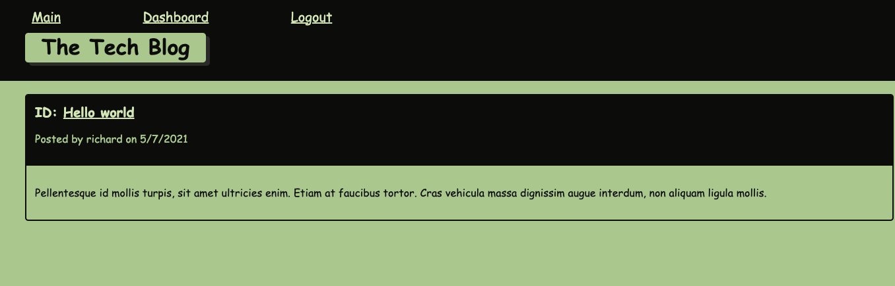
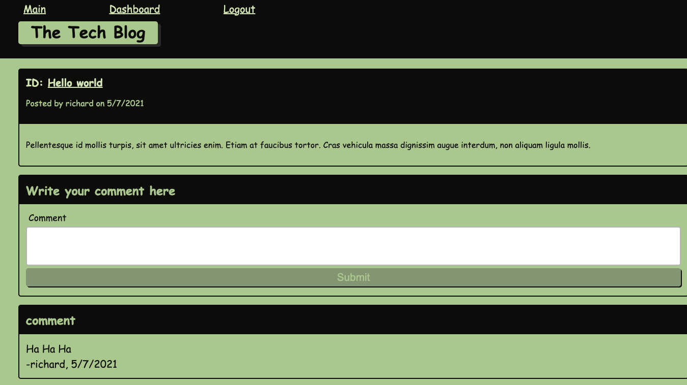
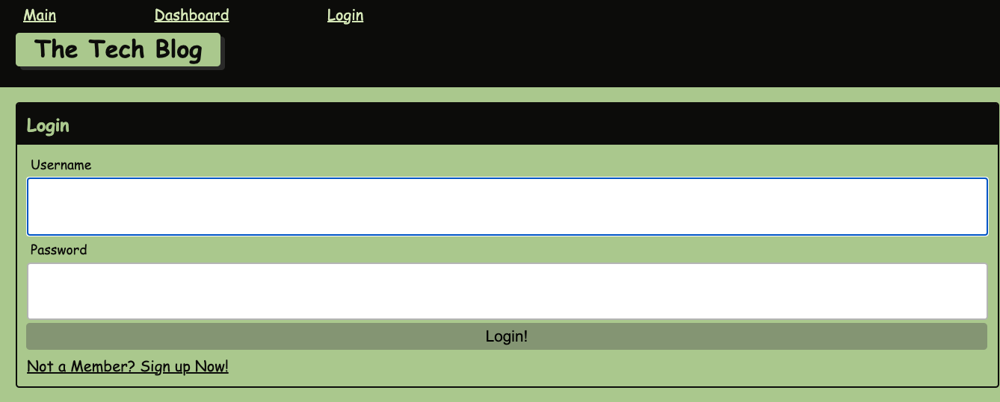

### 16. Interactive Full-Stack Project

## Description 

“The mind is not a vessel to be filled, but a fire to be kindled.”

Were you too embarassed to share your toughts, May "Mind-setter" bring you the peace.

Share your thoughts on your blog to get love and favor by commenting by others. "Mind-setter" Free judgement Zone

## Table of Contents (Optional)

* [Installation](#installation)
* [Usage](#usage)
* [Technology](#technology)
* [Credits](#credits)
* [License](#license)

## Installation

- Please visit Website https://enigmatic-bayou-14711.herokuapp.com/

## Usage 

- Once Your logged in, you see the list of people, What the think, when post was created and the 'love btn' so you can love the post!

- try not to over use love, we will already know how much you love the post

- once you click the love btn, system will confirm your favor of post

- but first, you gotta log in

- Not a member? no problem, sign in now!!

- click the MINDSET to see all you've POST + all the comment people commented

- Gotta change your mind? You meant to say something else instead? Rethink to update your mind, or simply medidate to flush your thoughts!

- wanna leave the comment? 2 ways to leave the comment: 
1. press comment btn on main pg
or
2. go to the post and leave the comment there
easy

- BE SURE TO LOG OUT BEFORE YOU LEAVE. DO NOT LET OTHERS TO INVADE YOUR BRAIN

## Technology
    - Express
    - Npm
    - Java Script
    - nodejs
    - inquirer
    - Mysql2
    - Mysql workbench
    - express handlebars
    - dotenv
    - bcrypt

## Credits

 - Richard Kim: richardyjkim (github)

## License

MIT License

Copyright (c) [2021] [Richard Y Kim]

Permission is hereby granted, free of charge, to any person obtaining a copy
of this software and associated documentation files (the "Software"), to deal
in the Software without restriction, including without limitation the rights
to use, copy, modify, merge, publish, distribute, sublicense, and/or sell
copies of the Software, and to permit persons to whom the Software is
furnished to do so, subject to the following conditions:

The above copyright notice and this permission notice shall be included in all
copies or substantial portions of the Software.

THE SOFTWARE IS PROVIDED "AS IS", WITHOUT WARRANTY OF ANY KIND, EXPRESS OR
IMPLIED, INCLUDING BUT NOT LIMITED TO THE WARRANTIES OF MERCHANTABILITY,
FITNESS FOR A PARTICULAR PURPOSE AND NONINFRINGEMENT. IN NO EVENT SHALL THE
AUTHORS OR COPYRIGHT HOLDERS BE LIABLE FOR ANY CLAIM, DAMAGES OR OTHER
LIABILITY, WHETHER IN AN ACTION OF CONTRACT, TORT OR OTHERWISE, ARISING FROM,
OUT OF OR IN CONNECTION WITH THE SOFTWARE OR THE USE OR OTHER DEALINGS IN THE
SOFTWARE.

© 2021 Trilogy Education Services, LLC, a 2U, Inc. brand. Confidential and Proprietary. All Rights Reserved.
